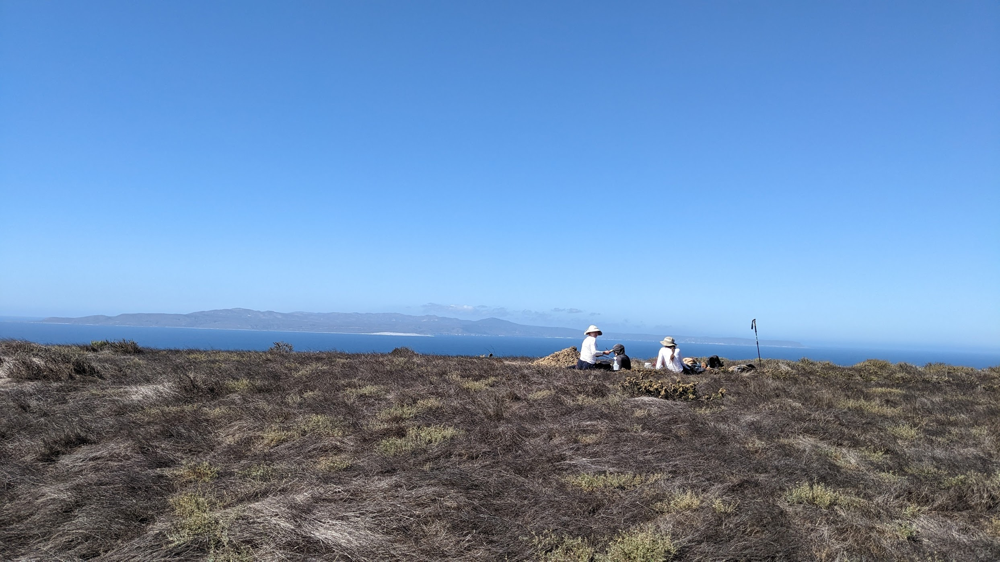
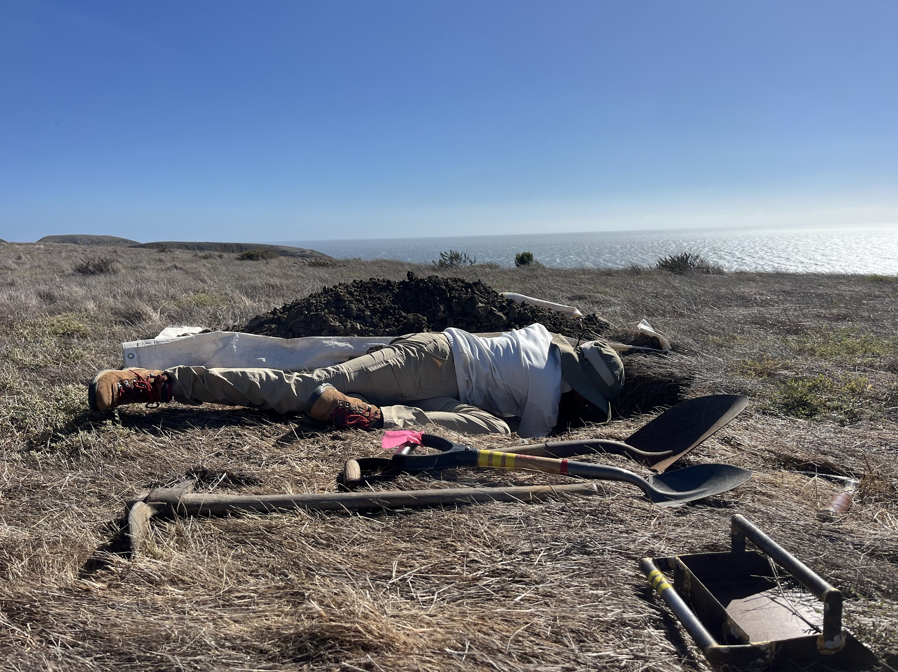
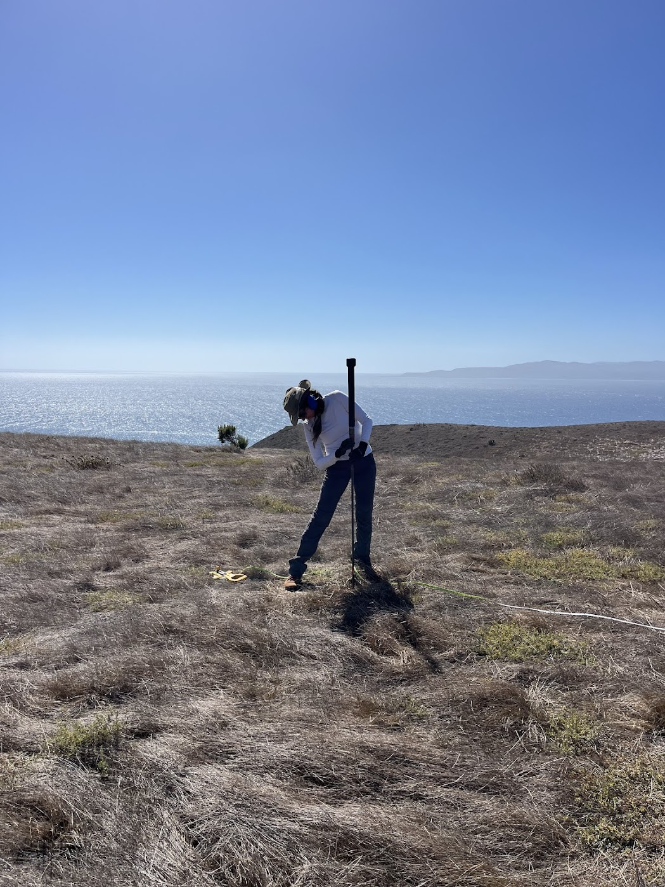
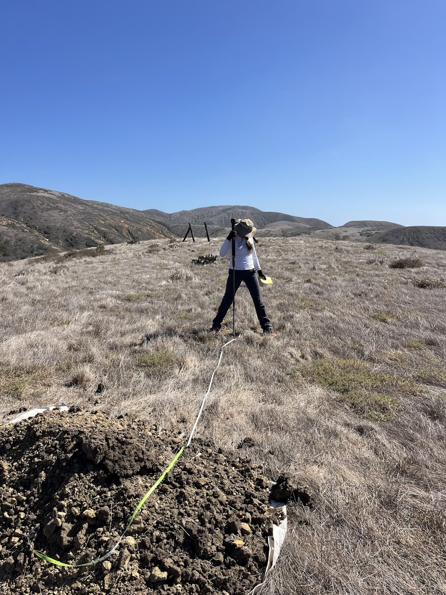
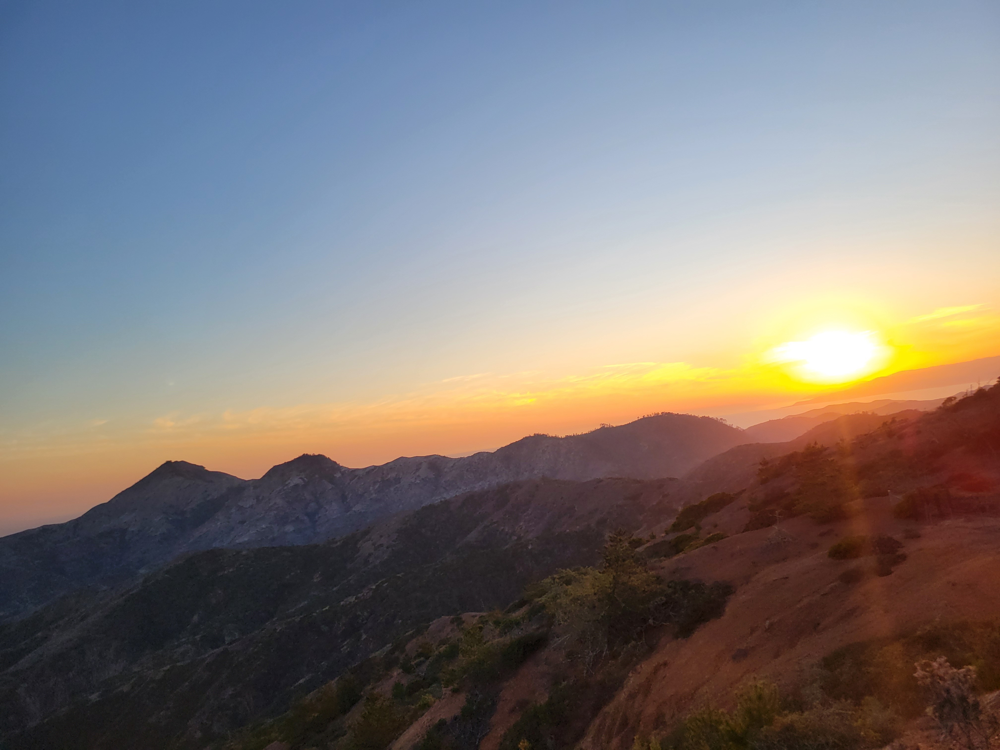
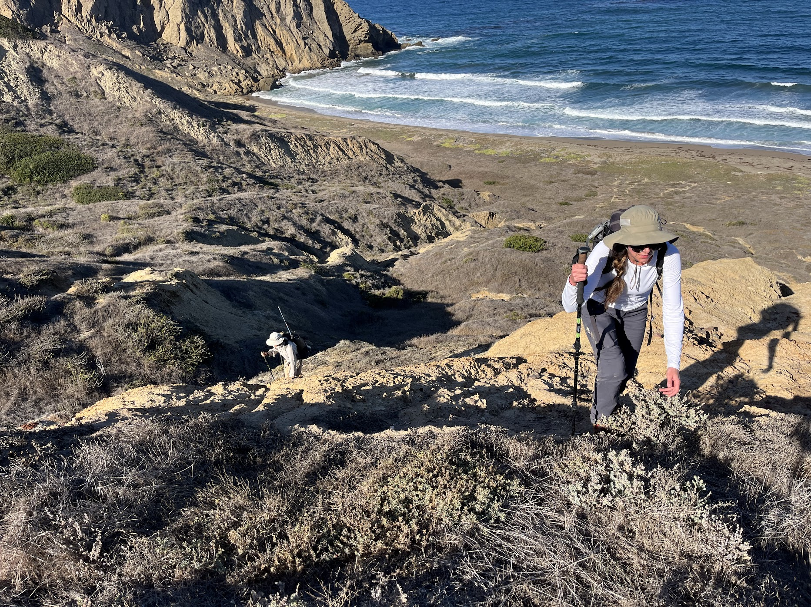
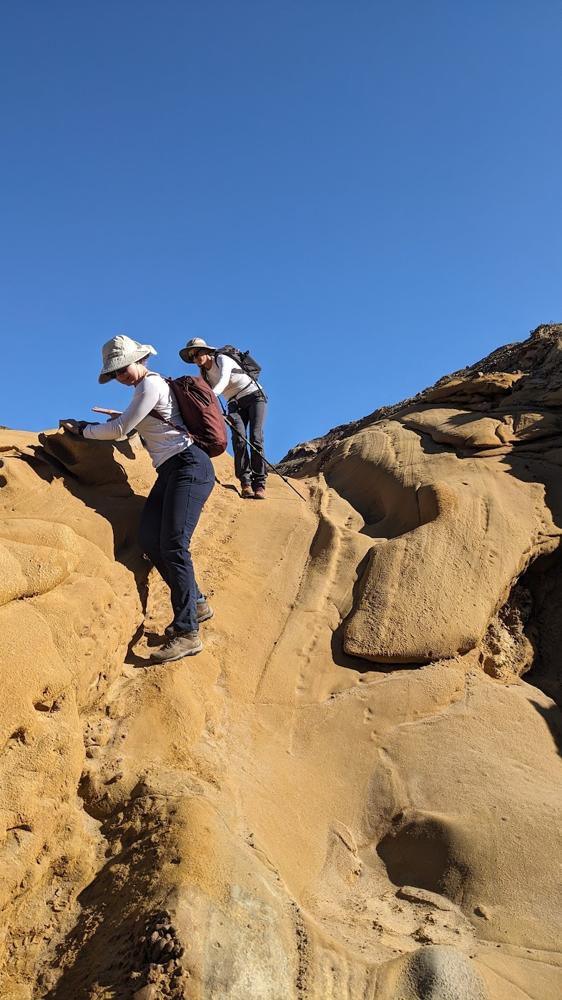
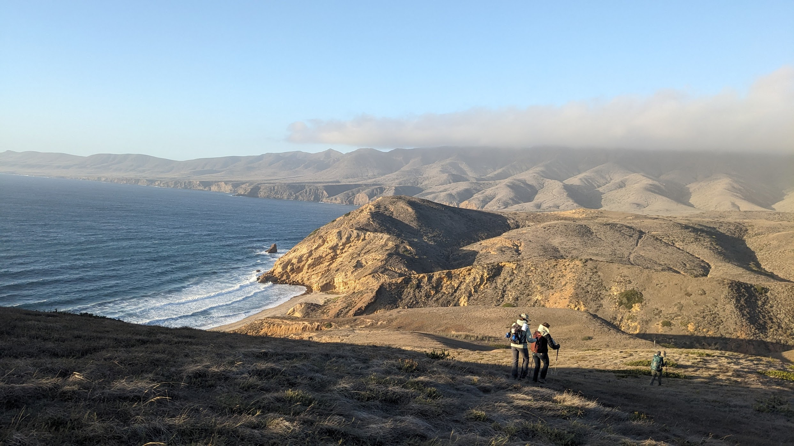
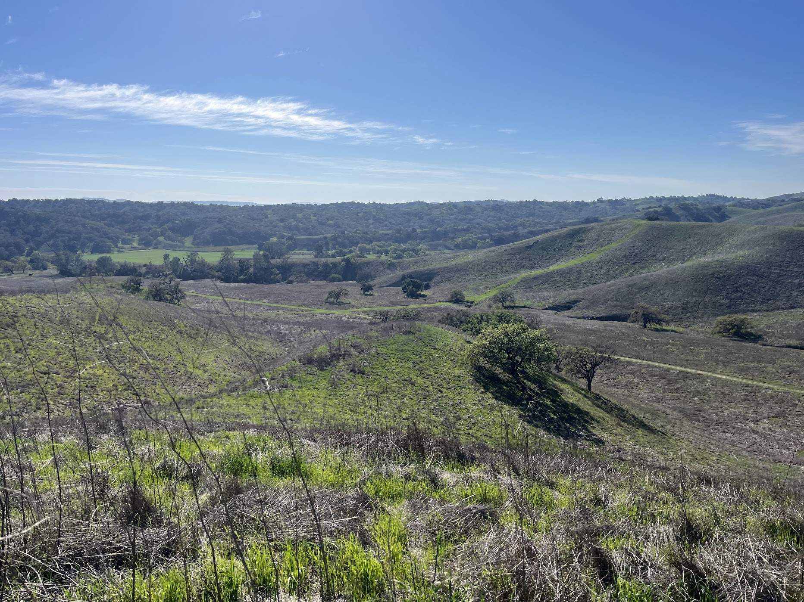

A collection of photos from places where I have worked, learned, explored, and made memories.

*Select an area, then click any photo to view it in full size.*

<strong>Santa Cruz Island</strong>
<small>Santa Cruz Island Reserve, field sites, trails, and island landscapes · 11 photos</small>

::: {.gallery layout-ncol=3}

{group="sci-gallery"}

{group="sci-gallery"}

{group="sci-gallery"}

{group="sci-gallery"}

{group="sci-gallery"}

{group="sci-gallery"}

{group="sci-gallery"}

{group="sci-gallery"}

{group="sci-gallery"}

{group="sci-gallery"}

{group="sci-gallery"}

:::

<strong>Sedgwick Reserve</strong>
<small>Research, class projects, and reserve landscapes · 1 photo</small>

::: {.gallery layout-ncol=3}

{group="sedgwick-gallery"}

:::

🏜️

<strong>Mojave Desert</strong>
<small>Sweeney Granite Mountains Desert Research Center, Mojave Preserve, and nearby public lands · Photos coming soon</small>

Photos of desert landscapes, field experiences, wildlife, and time spent exploring the Mojave will be added here.

🌿

<strong>Panama</strong>
<small>Panama City, Pipeline Road, Barro Colorado Island, and other places visited · Photos coming soon</small>

Photos of program activities, travel, wildlife, landscapes, and experiences throughout Panama will be added here.

