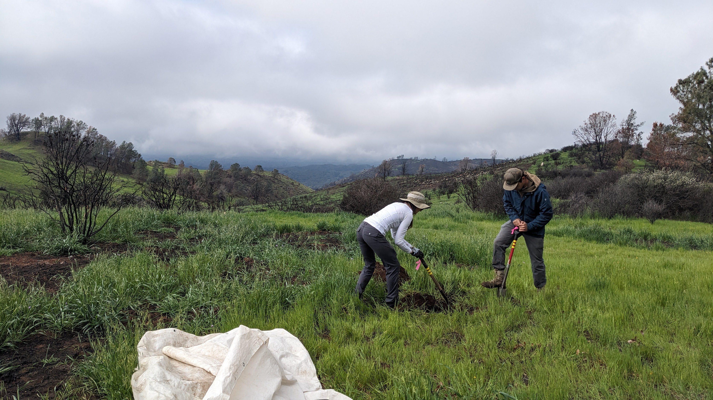
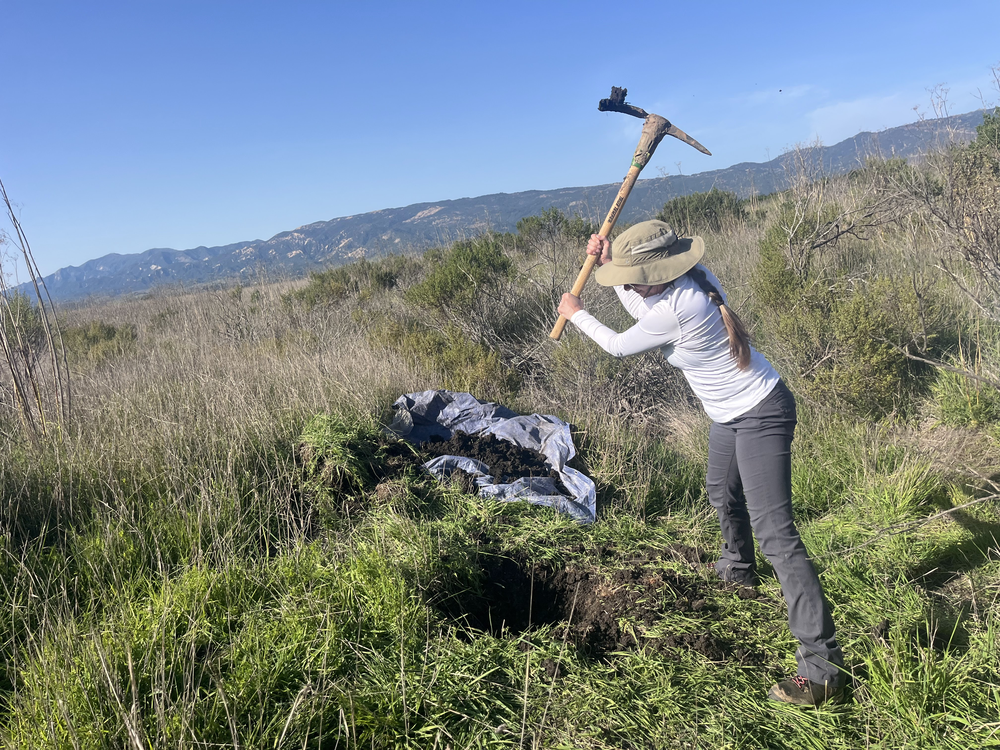
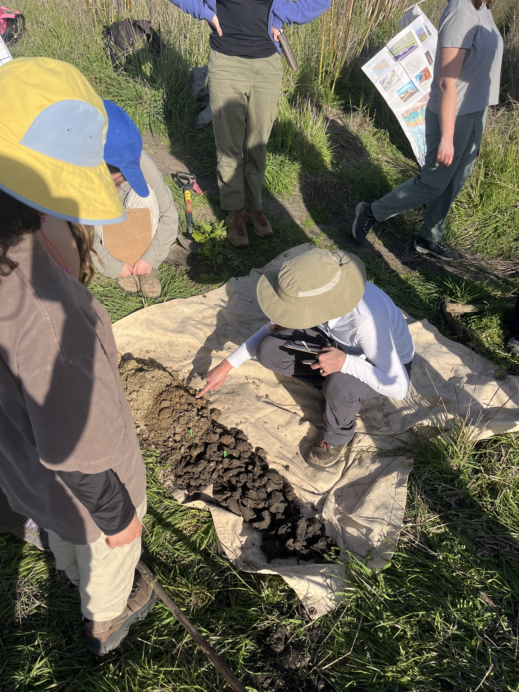
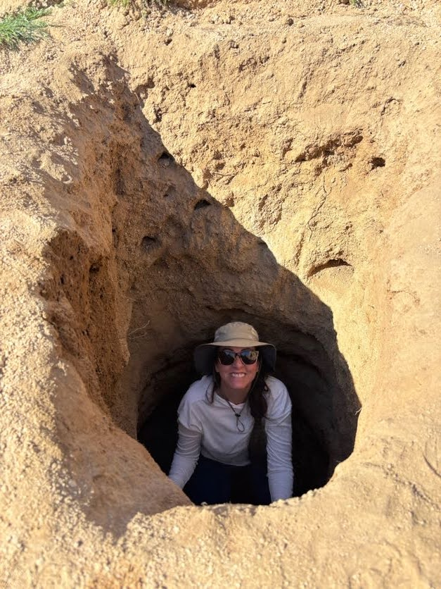
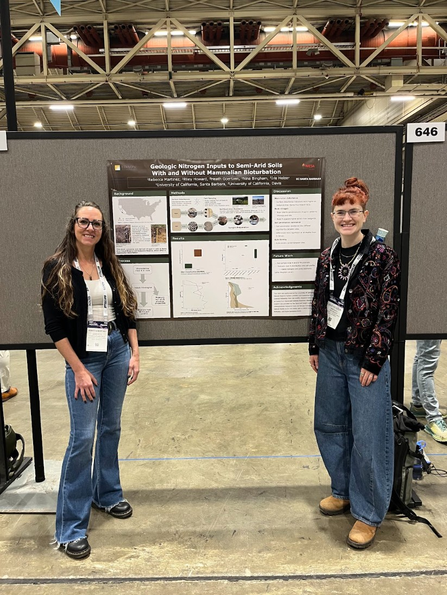
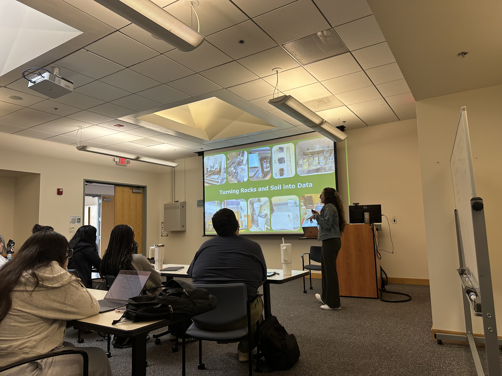

A collection of photos from fieldwork, travel, academic programs, presentations, community events, and other memorable experiences.

*Select a gallery, then click any photo to view it in full size.*

<strong>Santa Cruz Island</strong>
<small>Santa Cruz Island Reserve, field sites, trails, and island landscapes</small>

::: {.gallery layout-ncol=3}

{group="sci-gallery"}

{group="sci-gallery"}

{group="sci-gallery"}

{group="sci-gallery"}

{group="sci-gallery"}

{group="sci-gallery"}

{group="sci-gallery"}

{group="sci-gallery"}

{group="sci-gallery"}

{group="sci-gallery"}

{group="sci-gallery"}

:::

<strong>Sedgwick Reserve</strong>
<small>Research, class projects, and reserve landscapes</small>

::: {.gallery layout-ncol=3}

{group="sedgwick-gallery"}

{group="sedgwick-gallery"}

:::

<strong>Santa Barbara Area</strong>
<small>UCSB, Goleta, More Mesa, local beaches, trails, and nearby natural areas</small>

::: {.gallery layout-ncol=3}

{group="sb-gallery"}

{group="sb-gallery"}

:::

<strong>Mojave Desert</strong>
<small>Sweeney Granite Mountains Desert Research Center, Mojave National Preserve, and nearby public lands</small>

::: {.gallery layout-ncol=3}

{group="mojave-gallery"}

:::

🌿

<strong>Panama</strong>
<small>Panama City, Pipeline Road, Barro Colorado Island, and other places visited · Photos coming soon</small>

Photos of program activities, travel, wildlife, landscapes, and experiences throughout Panama will be added here.

<strong>Programs, Presentations, and Events</strong>
<small>Conferences, posters, academic programs, outreach, and community events</small>

::: {.gallery layout-ncol=3}

{group="other-gallery"}

{group="other-gallery"}

:::

