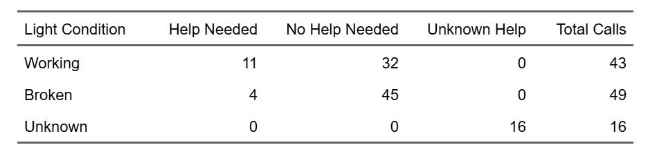
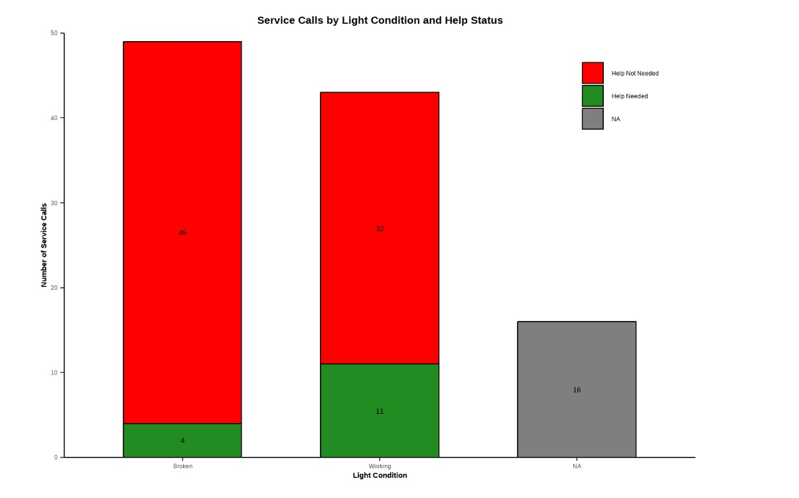
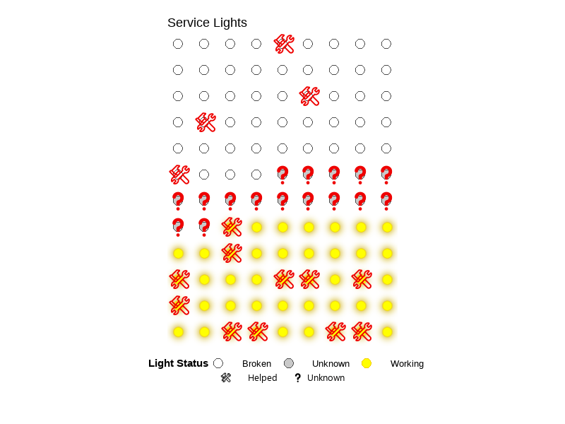

<!-- GLightbox CSS -->
<link href="https://cdn.jsdelivr.net/npm/glightbox/dist/css/glightbox.min.css" rel="stylesheet">

<!-- GLightbox JS -->

This page highlights selected projects from my research, courses, and academic programs.

*Click on a project to learn more.*

## Research Projects

<article
  class="project-preview-card"
  role="button"
  tabindex="0"
  aria-label="View Geologic Nitrogen Inputs project"
  data-bs-toggle="modal"
  data-bs-target="#soil-project-modal">

Geologic Nitrogen and Mammalian Bioturbation Soil Research

Undergraduate Research · UC Santa Barbara

</article>

## Course Projects

<button
  type="button"
  class="project-scroll-button"
  data-scroll="left"
  data-target="course-project-carousel"
  aria-label="View previous project">
  ‹
</button>

<article
  class="project-preview-card"
  role="button"
  tabindex="0"
  aria-label="View Lompoc Edible Trail Proposal"
  data-bs-toggle="modal"
  data-bs-target="#edible-trail-modal">

Lompoc Edible Trail Proposal

ENV S 155 · UC Santa Barbara

</article>

<article
  class="project-preview-card"
  role="button"
  tabindex="0"
  aria-label="View Service Lights project"
  data-bs-toggle="modal"
  data-bs-target="#service-lights-modal">

Comparing Assistance Needs and Service Light Functionality

ENV S 193DS · UC Santa Barbara

</article>

<article
  class="project-preview-card"
  role="button"
  tabindex="0"
  aria-label="View The 2004 Indian Ocean Tsunami project"
  data-bs-toggle="modal"
  data-bs-target="#tsunami-modal">

The 2004 Indian Ocean Tsunami

EARTH 20 · UC Santa Barbara

</article>

<article
  class="project-preview-card"
  role="button"
  tabindex="0"
  aria-label="View Rough-Skinned Newt versus Garter Snake project"
  data-bs-toggle="modal"
  data-bs-target="#newt-snake-modal">

Rough-Skinned Newt vs. Garter Snake

BIOL 155 · Allan Hancock College

</article>

<button
  type="button"
  class="project-scroll-button"
  data-scroll="right"
  data-target="course-project-carousel"
  aria-label="View next project">
  ›
</button>

## Other Projects

<article
  class="project-preview-card"
  role="button"
  tabindex="0"
  aria-label="View Species and Functional Richness Comparison"
  data-bs-toggle="modal"
  data-bs-target="#bird-richness-modal">

Species and Functional Richness Comparison

UCSB–Smithsonian Scholars Program · Panama

</article>

<!-- ==================================
     PROJECT MODALS
     ================================== -->

<!-- Soil Research Project -->

<h2 class="modal-title" id="soil-project-title">
Geologic Nitrogen Inputs to Semi-Arid Soils
</h2>

<button
  type="button"
  class="project-modal-close"
  data-bs-dismiss="modal"
  aria-label="Close project">
  Close ×
</button>

<h3>Abstract</h3>

<strong><em>Geologic Nitrogen Inputs to Semi-Arid Soils with and without Mammalian Bioturbation</em></strong>

<strong>Authors:</strong> Rebecca Martinez, Riley Howard, Heath Goertzen, Nina Bingham, and Iris Holzer

Nitrogen is a critical nutrient for plant productivity and ecosystem health, but not all sources of nitrogen are well understood. One such poorly understood source is nitrogen trapped in rocks, which can be released into soils and then used by plants and other organisms. This study examines nitrogen in rocks and its movement into soils in a climate from which we have limited data: semi-arid Mediterranean ecosystems.

Some of these ecosystems include mammals that mix the soil, such as gophers, which may help move nitrogen from rocks higher into the soil. We measured nitrogen in rocks at two Central California sites, with and without these mammals, and found a wide range of nitrogen concentrations across different rock types. Additional soil data will allow for a more detailed assessment of how nitrogen moves from rocks into soils across the two sites.

<!-- Edible Trail Project -->

<h2 class="modal-title" id="edible-trail-title">
Lompoc Edible Trail Proposal
</h2>

<button
  type="button"
  class="project-modal-close"
  data-bs-dismiss="modal"
  aria-label="Close project">
  Close ×
</button>

<strong>University of California, Santa Barbara</strong> 
<em>ENV S 155 – Built Environment</em>

An artistic proof-of-concept proposal for transforming underused green spaces in Lompoc into edible walking trails that promote community connection, health, and sustainability. This fictional concept was created as a final project and is not an actual or funded plan.

<h3>Project Highlights</h3>

<ul>
<li>Community-centered design incorporating native and edible plants</li>
<li>Safe walking paths with shade, seating, and public art</li>
<li>Hands-on workshops and volunteer planting days</li>
<li>Interactive timeline and map for project phases and locations</li>
</ul>

<h3>Tools Used</h3>

Quarto, HTML, CSS, Leaflet.js, and community engagement frameworks

<h3>View Project</h3>

<iframe
  class="project-website"
  src="https://rebeccalmartinez.github.io/ENVS-155-proj/"
  title="Lompoc Edible Trail Proposal Project"
  loading="lazy">
</iframe>

Note: This is a fictional concept created for academic purposes only.

<a
  class="project-link-button"
  href="https://github.com/RebeccaLMartinez/ENVS-155-proj"
  target="_blank"
  rel="noopener">
  View GitHub Repository
</a>

<!-- Service Lights Project -->

<h2 class="modal-title" id="service-lights-title">
Service Lights
</h2>

<button
  type="button"
  class="project-modal-close"
  data-bs-dismiss="modal"
  aria-label="Close project">
  Close ×
</button>

<strong>University of California, Santa Barbara</strong> 
<em>ENV S 193DS – Data Science for Environmental Studies</em>

A class project exploring the relationship between lighting conditions and service-call outcomes using a self-collected dataset (n = 108). The project included a bar chart, summary table, and blinking lightboard animation.

<h3>Tools Used</h3>

RStudio, Quarto, tidyverse, here, flextable, janitor, ggtext, ggfx, gganimate, and showtext

<h3>Visuals</h3>

<a
  class="project-link-button"
  href="https://github.com/RebeccaLMartinez/ENVS-193DS_homework-03"
  target="_blank"
  rel="noopener">
  View GitHub Repository
</a>

<!-- Indian Ocean Tsunami Project -->

<h2 class="modal-title" id="tsunami-title">
The 2004 Indian Ocean Tsunami
</h2>

<button
  type="button"
  class="project-modal-close"
  data-bs-dismiss="modal"
  aria-label="Close project">
  Close ×
</button>

<strong>University of California, Santa Barbara</strong> 
<em>EARTH 20</em>

A short video project examining the 2004 Indian Ocean tsunami and the geologic processes behind the event.

More details coming soon.

<h3>Watch the Video</h3>

<video controls preload="metadata" playsinline>

<source
  src="media/the2004-indian-ocean-tsunami.mp4"
  type="video/mp4">

Your browser does not support embedded video.

</video>

<!-- Newt and Garter Snake Project -->

<h2 class="modal-title" id="newt-snake-title">
Rough-Skinned Newt vs. Garter Snake
</h2>

<button
  type="button"
  class="project-modal-close"
  data-bs-dismiss="modal"
  aria-label="Close project">
  Close ×
</button>

<strong>Allan Hancock College</strong> 
<em>BIOL 155 – Zoology</em>

<em>A collaborative video project with Darlene Vera, with assistance from friends in the Department of Fine Arts.</em>

The co-evolution of toxin production in rough-skinned newts and toxin resistance in garter snakes served as the focus of this short and silly film designed to make complex science accessible. The project combined storytelling, visual art, and evolutionary biology to communicate this dynamic relationship.

<h3>Tools Used</h3>

Scriptwriting, storyboarding, filmmaking, and Adobe Premiere

<h3>Watch the Video</h3>

<iframe
  src="https://www.youtube.com/embed/cFefwwtAHF8?si=m9Jg2OOTCrdrWtRe"
  title="Rough-Skinned Newt and Garter Snake video"
  loading="lazy"
  data-reset-on-close
  allow="accelerometer; autoplay; clipboard-write; encrypted-media; gyroscope; picture-in-picture; web-share"
  referrerpolicy="strict-origin-when-cross-origin"
  allowfullscreen>
</iframe>

<!-- Smithsonian Scholars Project -->

<h2 class="modal-title" id="bird-richness-title">
Species and Functional Richness Comparison
</h2>

<button
  type="button"
  class="project-modal-close"
  data-bs-dismiss="modal"
  aria-label="Close project">
  Close ×
</button>

<strong>UCSB–Smithsonian Scholars Program</strong> 
<em>Advanced Field Research Training at the Smithsonian Tropical Research Institute in Panama · Summer 2023</em>

This final program project compared the species richness and functional richness of bird communities between Barro Colorado Island and Pipeline Road in mainland Panama. We used autonomous recorders and avian trait databases to examine diversity patterns in two distinct habitats. The results reflect program learning outcomes rather than a comprehensive biodiversity assessment.

<h3>Project Team</h3>

<strong><em>The Orependulas</em></strong>

Brandon Leon, Rebecca Martinez, Daniel Romero, Mathew Silva, and Zachary Wilson

<h3>Tools Used</h3>

<ul>
<li>AudioMoths</li>
<li>RStudio</li>
<li>tidyverse</li>
<li>mFD</li>
<li>phytools</li>
<li>BirdNET-Analyzer</li>
<li>AVONET bird trait dataset</li>
<li>Birds of Panama</li>
</ul>

<h3>Process</h3>

<ul>
<li>Deployed 12 AudioMoths to record the dawn chorus</li>
<li>Conducted point counts for visual confirmation</li>
<li>Analyzed 24 audio files using BirdNET-Analyzer</li>
<li>Combined detections with trait data from AVONET and Birds of Panama</li>
<li>Created visualizations in RStudio</li>
</ul>

<h3>Poster</h3>

Presented at the 2023 Cal Poly Summer Internship Research Symposium and the 2023 UCSB Fall Undergraduate Research Showcase.

