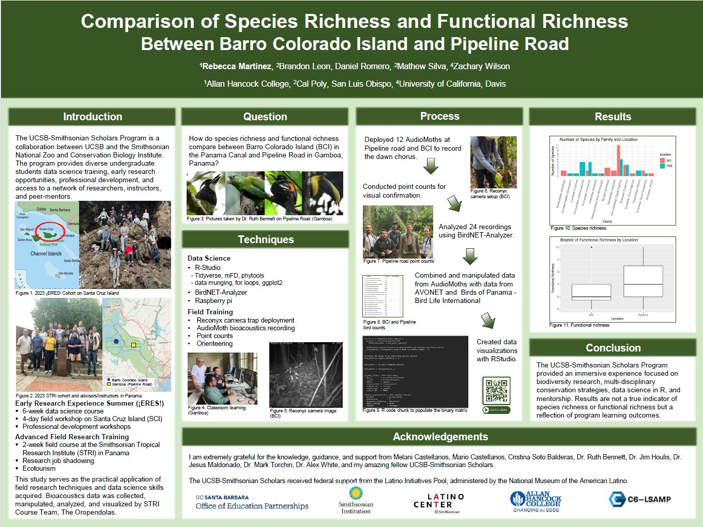

<!-- Glightbox CSS -->
<link href="https://cdn.jsdelivr.net/npm/glightbox/dist/css/glightbox.min.css" rel="stylesheet" />

<!-- Glightbox JS -->
<script src="https://cdn.jsdelivr.net/npm/glightbox/dist/js/glightbox.min.js"></script>

This page highlights some of my work from classes and research.

***


# 🌱 Soil Bioturbation

<details>
  <summary style="color: #4FA78D; cursor: pointer;">Click to expand</summary>
  
***Geologic Nitrogen Inputs to Semi-Arid Soils with and without Mammalian Bioturbation***

Authors: Rebecca Martinez, Riley Howard, Heath Goertzen, Nina Bingham, Iris Holzer

Nitrogen is a critical nutrient for plant productivity and ecosystem health, but not all sources of nitrogen are well understood. One such poorly understood source is nitrogen trapped in rocks, which can be released into soils and then used by plants and other organisms. This study examines nitrogen in rocks and its movement into soils in a climate from which we have limited data: semi-arid Mediterranean ecosystems. Some of these ecosystems include mammals that mix the soil, like gophers, which may play a role in moving nitrogen from rocks higher up in the soil. We measured nitrogen in rocks at two Central California sites, with and without these mammals, and found a wide range of nitrogen concentrations across different rock types. Additional soils data will allow for a more detailed assessment of the movement of nitrogen from rocks into soils across these two sites, helping us to better understand nutrient dynamics in these semi-arid ecosystems.

---

</details>

# 🛣️️ Edible Trail Proposal

<details>
  <summary style="color: #4FA78D; cursor: pointer;">Click to expand</summary>

**University of California, Santa Barbara (UCSB)**  
*ENVS 155 – Built Environment*

An artistic proof-of-concept proposal for transforming underused green spaces in Lompoc into edible walking trails that promote community connection, health, and sustainability. This fictional concept was created as a final project and is not an actual or funded plan.

### **Project Highlights**

- Community-centered design incorporating native and edible plants  
- Safe walking paths with shade, seating, and public art  
- Hands-on workshops and volunteer planting days  
- Interactive timeline and map for project phases and locations

### **Tools Used**

Quarto, HTML, CSS, Leaflet.js, Community Engagement Frameworks

### **View Project**

<iframe 
  src="https://rebeccalmartinez.github.io/ENVS-155-proj/" 
  style="width: 100%; height: 600px; border: none; margin-top: 1rem;" 
  title="Edible Trail Proposal Project">
</iframe>

<p style="margin-top: 1rem; font-style: italic; color: #bbb;">
  *Note: This is a fictional concept for academic purposes only.*
</p>

### **Resources**

- [GitHub Repository](https://github.com/RebeccaLMartinez/ENVS-155-proj){target="_blank"}

---

</details>


# 💡 Service Lights
<details>
  <summary style="color: #4FA78D; cursor: pointer;">Click to expand</summary>

**University of California, Santa Barbara (UCSB)**  
*ENVS 193DS – Data Science for Environmental Studies*

A class project that explores the relationship between lighting conditions (working vs. broken) and service call outcomes (needing help or not) using a self-collected dataset (n=108). Created a bar chart, summary table, and a blinking lightboard animation (gif). See visuals.

### **Tools Used**  

RStudio (tidyverse, here, flextable, janitor, ggtext, ggfx, gganimate, showtext), Quarto


### **Code Snippet**

This converts help and working columns in service_data to TRUE/FALSE values by making their text uppercase and then to logical type, then saves the result as a new object called clean_service_data.

```r
clean_service_data <- service_data |>
  mutate(
    help = as.logical(toupper(help)),
    working = as.logical(toupper(working))
  )
```

### **Visuals**  

:::{.panel-tabset}

#### Service Light Table

[](/media/light_table.jpg){.glightbox data-glightbox="title: Service Light Table"}

#### Service Light Bar Chart

[](/media/service_light_bar.jpg){.glightbox data-glightbox="title: Service Light Bar Chart"}

#### Blinking Lights Animation

[](/media/blinking_lights.gif){.glightbox data-glightbox="title: Blinking Lights Animation"}

:::

### **Resources**

<a href="https://github.com/RebeccaLMartinez/ENVS-193DS_homework-03" target="_blank" style="
    color: white; 
    padding: 8px 12px; 
    cursor: pointer; 
    background-color: transparent;
    transition: background-color 0.3s ease;
    border-radius: 4px;
    display: inline-block;
" 
   onmouseover="this.style.backgroundColor='#4FA78D';" 
   onmouseout="this.style.backgroundColor='transparent';">
  GitHub Repo
</a>

---

</details>


# 🦎 Rough Skinned Newt vs. Garter Snake

<details>
  <summary style="color: #4FA78D; cursor: pointer;">Click to expand</summary>

**Allan Hancock College**  
*BIOL 155 – Zoology*

*Collaborative video project with Darlene Vera, with help from friends in the Department of Fine Arts.*

The co-evolution of toxin production in rough-skinned newts and toxin resistance in garter snakes served as the focus of a short film designed to make complex science accessible. The project combined storytelling, visual art, and evolutionary biology to communicate this dynamic relationship.

### **Tools Used**
Scriptwriting, Storyboarding, Filmmaking, Adobe Premiere (editing)

### **Watch the Video**
<iframe width="560" height="315" src="https://www.youtube.com/embed/cFefwwtAHF8?si=m9Jg2OOTCrdrWtRe" title="YouTube video player" frameborder="0" allow="accelerometer; autoplay; clipboard-write; encrypted-media; gyroscope; picture-in-picture; web-share" referrerpolicy="strict-origin-when-cross-origin" allowfullscreen></iframe>

--- 

</details>


# 🐦 Species & Functional Richness Comparison

<details>
  <summary style="color: #4FA78D; cursor: pointer;">Click to expand</summary>

**UCSB-Smithsonian Scholars Program**  
*Advanced Field Research Training at the Smithsonian Tropical Research Institute (STRI) in Panama, Summer 2023*

Final project from an immersive data science and field course. This project compares species richness and functional richness of bird communities between Barro Colorado Island (BCI) and Pipeline Road (mainland Panama). We used autonomous recorders (AudioMoths) and avian trait databases to examine diversity patterns in two distinct habitats. Results reflect learning outcomes rather than comprehensive biodiversity assessments.

### **Project Team**

***The Orependulas***
  
Brandon Leon, Rebecca Martinez, Daniel Romero, Mathew Silva, and Zachary Wilson.


### **Tools Used**

- AudioMoths
- RStudio (tidyverse, mFD, phytools)
- BirdNET-Analyzer (Cornell Lab of Ornithology)
- AVONET – Comprehensive bird trait dataset
- Birds of Panama – BirdLife International

### **Process**

→ Deployed 12 AudioMoths to record dawn chorus 

→ Conducted point counts for visual confirmation  

→ Analyzed 24 audio files using BirdNET-Analyzer  

→ Combined detections with trait data from AVONET and Birds of Panama  

→ Created visualizations in RStudio  


### **Code Snippet**

Code for species richness bar graph.

```r
merged_df <- bind_rows(pipeline_found_joined, bci_birds_joined)

merged_df <- merged_df %>%
  mutate(location = ifelse(row_number() <= 26, substr(location, 1, 4), location)) %>%
  mutate(location = ifelse(row_number() >= 27 & row_number() <= 66, substr(location, 1, 3), location))

family_count <- merged_df %>%
  group_by(Family, location) %>%
  summarize(num_species = n())

ggplot(family_count, aes(x = Family, y = num_species, fill = location)) +
  geom_bar(stat = "identity", position = "dodge") +
  labs(title = "Number of Species by Family and Location",
       x = "Family",
       y = "Number of Species") +
  theme_minimal() +
  scale_y_continuous(breaks = seq(0, max(family_count$num_species), 1)) +
  theme(axis.text.x = element_text(angle = 75, hjust = 1), axis.text = element_text(size = 8))
  
```

### **Visuals**

*Under construction...*

:::{.panel-tabset}

#### Functional Richness Boxplot by Location

<!-- [](){glightbox ="Functional Richness Boxplot by Location"} -->

#### Species Count by Family and Location

<!-- [](){glightbox ="Species Count by Family and Location"} -->

#### Map of Sampling Locations

<!-- [](){glightbox ="Map of Sampling Locations"} -->

:::

### Poster

Presented findings at the 2023 Cal Poly Summer Internship Research Symposium and the 2023 UCSB Fall Undergraduate Research Showcase.

[](/media/panama_bci_richness_poster.jpg){.glightbox data-title="Comparison of Species Richness & Functional Richness Between BCI and Pipeline Road"}


---

</details>


<script>
  const lightbox = GLightbox({
    selector: '.glightbox'
  });
</script>